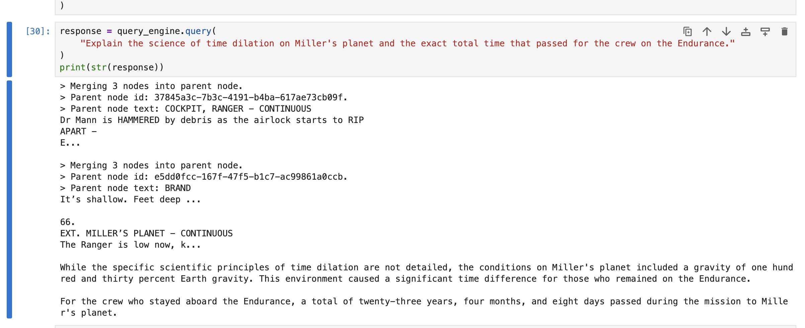
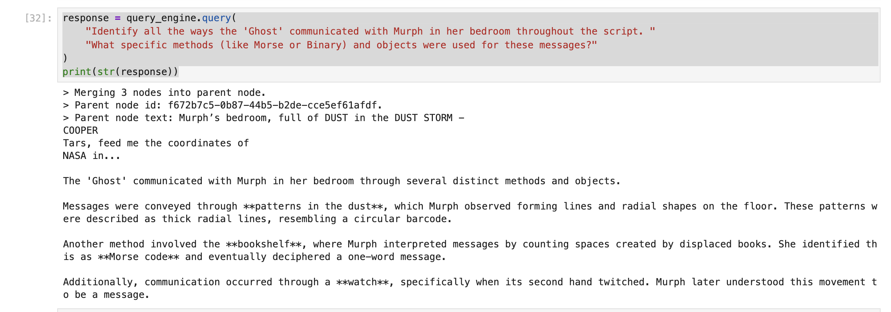
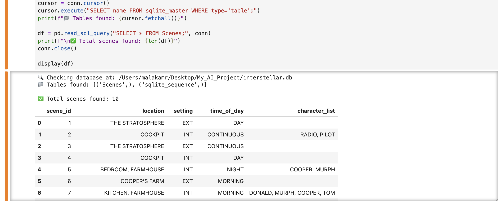
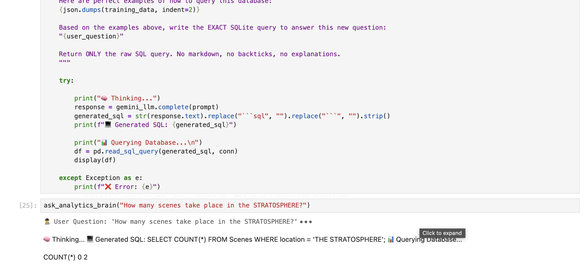

# 🌌 The Dual-Engine Detective: Interstellar AI

### **Project Overview**
This project explores the intersection of unstructured natural language processing and structured data querying by building a "Dual-Engine" AI agent capable of analyzing the 157-page script of the movie *Interstellar*. Rather than relying on a single model, the architecture is split into two specialized brains to handle both qualitative narrative analysis and quantitative data extraction.

---

### **The Architecture**

#### **1. The Lore Brain (Auto-Merging RAG Engine)**
* **File:** `Interstellar_AutoMerging_RAG_Engine.ipynb`
* **Focus:** Unstructured Data & Narrative Comprehension.
* **Description:** This engine implements an Auto-Merging Retrieval-Augmented Generation (RAG) pipeline using LlamaIndex. It ingests the raw PDF script, chunks the text contextually, and builds a vector search engine capable of answering complex narrative questions, explaining plot mechanics, and retrieving specific dialogue without hallucinating storylines.

**Proof of Execution:**
*Extracting complex plot mechanics (Miller's Planet Time Dilation):*

*Connecting multi-threaded narrative elements (The Ghost's Communication Methods):*

---

#### **2. The Analytics Brain (SQL Synthetic Agent)**
* **File:** `Interstellar_SQL_Synthetic_Agent.ipynb`
* **Focus:** Structured Data, Schema Mapping & Logic.
* **Description:** This notebook acts as the quantitative engine. It utilizes an LLM to scrape and structure metadata (Scene Locations, INT/EXT, Time of Day, Characters) directly from the raw script into a relational SQLite database. It then generates synthetic training queries to strictly map the schema, powering a Few-Shot SQL Agent that translates natural language into flawless SQL queries to answer hard data questions with zero hallucinations.

**Proof of Execution:**
*Automated extraction of unstructured text into a clean SQLite/Pandas DataFrame:*

*The Few-Shot Agent successfully translating a natural language question into an executable SQL query:*

---

### **Tech Stack**
* **Languages:** Python, SQL
* **Frameworks/Libraries:** LlamaIndex, Pandas, SQLite3
* **LLMs:** Google Gemini (1.5/2.5 Flash & Pro)

### **Key Features**
* **Automated Data Scraper:** Converts raw PDF screenplays into structured JSON and SQL tables.
* **Synthetic Data Generation:** Creates high-quality Question/SQL pairs to train the agent on the specific database schema.
* **Few-Shot Prompting:** Executes hallucination-free database queries through natural language.
* **Auto-Merging Retrieval:** Dynamically merges smaller text chunks into parent nodes to provide LLMs with better narrative context.
